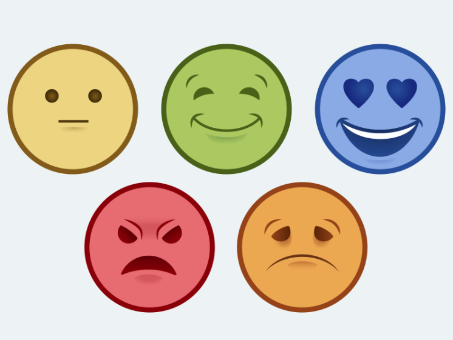

# 📊 Análise de Sentimentos com Naive Bayes - Classificação de Resenhas de Filmes

<p align="center">  </p>


## 🌟 Visão Geral

Este projeto implementa um **classificador de sentimentos** utilizando o algoritmo Naive Bayes para analisar resenhas de filmes do dataset IMDb. O modelo alcança **80% de acurácia** na classificação de textos como positivos ou negativos, demonstrando a eficácia de técnicas de Processamento de Linguagem Natural (NLP) em tarefas de análise de sentimentos.

## 📌 Principais Recursos

✔ **Classificação binária** de sentimentos (positivo/negativo)  
✔ Pré-processamento avançado de texto (tokenização, stemming, remoção de stopwords)  
✔ Pipeline completo de machine learning (treinamento, validação, teste)  
✔ Visualizações interativas de desempenho do modelo  
✔ Exemplos práticos de classificação em tempo real  
✔ Documentação completa para reprodução do experimento  

## 📊 Performance do Modelo

| Métrica          | Negativas | Positivas | Média |
|------------------|----------|----------|-------|
| **Acurácia**     | -        | -        | 80%   |
| **Precisão**     | 77%      | 83%      | 80%   |
| **Recall**       | 85%      | 75%      | 80%   |
| **F1-Score**     | 0.81     | 0.79     | 0.80  |


## 🛠️ Tecnologias Utilizadas

### Linguagens e Frameworks


### Processamento de Dados


### Visualização


## 🚀 Como Executar

### Pré-requisitos
- Python 3.9+
- Git (para clonar o repositório)

### Instalação Rápida

```bash
# Clone o repositório
git clone https://github.com/giuliabugatti09/sentiment-analysis.git
cd sentiment-analysis

# Crie e ative o ambiente virtual (recomendado)
python -m venv venv
source venv/bin/activate  # Linux/Mac
venv\Scripts\activate     # Windows

# Instale as dependências
pip install -r requirements.txt

# Baixe os recursos do NLTK
python -c "import nltk; nltk.download('movie_reviews')"
```

### Executando o Projeto

```bash
# Opção 1: Executar o notebook Jupyter
jupyter notebook notebooks/sentiment_analysis.ipynb

# Opção 2: Executar o script principal
python src/main.py
```

## 📂 Estrutura do Projeto

```
sentiment-analysis/
├── data/                   # Dados brutos e processados
├── notebooks/              # Jupyter notebooks de análise
│   └── sentiment_analysis.ipynb
├── src/                    # Código fonte
│   ├── train_modelo.py             # Script de treinamento
│   ├── preprocess.py    # Funções de pré-processamento
│   └── visualization.py    # Geração de gráficos
├── images/                 # Visualizações e gráficos
├── requirements.txt        # Dependências
├── project_structure.txt        # Estrutura do projeto
└── README.md               # Este arquivo
```

## 📈 Visualizações Interativas

Explore os resultados dinamicamente:

1. **Fluxo do Processamento**  
     

2. **Evolução da Acurácia**  
   

3. **Comparação de Métricas**  
   

## 🧪 Exemplo Prático

Teste o modelo com suas próprias frases:

```python
from src.model import predict_sentiment

sample_reviews = [
    "This movie was absolutely fantastic! The acting was superb.",
    "Terrible plot and bad acting. Would not recommend.",
    "The film had some good moments but overall was mediocre."
]

for review in sample_reviews:
    print(f"Review: {review[:50]}...")
    print(f"Prediction: {predict_sentiment(review)}\n")
```

Saída esperada:
```
Review: This movie was absolutely fantastic! The acting...
Prediction: Positive

Review: Terrible plot and bad acting. Would not recom...
Prediction: Negative

Review: The film had some good moments but overall wa...
Prediction: Negative
```

## 📚 Fundamentos Teóricos

O projeto implementa um **Classificador Naive Bayes Multinomial**, particularmente adequado para dados textuais. O algoritmo calcula:

```
P(classe|documento) ∝ P(classe) × ∏ P(palavra|classe)
```

Onde:
- **P(classe)** é a probabilidade a priori de cada classe
- **P(palavra|classe)** é a probabilidade de cada palavra dado a classe, suavizada com Laplace smoothing

## 🤝 Como Contribuir

1. Faça um fork do projeto
2. Crie sua branch (`git checkout -b feature/improve-model`)
3. Commit suas mudanças (`git commit -m 'Add new features'`)
4. Push para a branch (`git push origin feature/improve-model`)
5. Abra um Pull Request

## 📜 Licença

Distribuído sob licença MIT. Veja `LICENSE` para mais informações.

## ✉️ Contato

Giulia Bugatti - [seu_email@example.com](mailto:giuliabugatti02@gmail.com)  
LinkedIn: [linkedin.com/in/giulianobugatti](https://www.linkedin.com/in/giulia-bugatti-fonseca-226955267/)

---

**Nota:** Para uma experiência completa, acesse o [notebook interativo no Google Colab](https://colab.research.google.com/drive/1zwU09L2hXFuFZFcfILG_vPO_4EUMH7T8).
